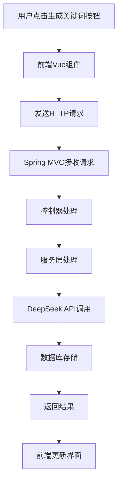

# 关键词生成数据流说明文档

## 一、整体流程



## 二、前端流程

### 1. 路由配置

```javascript
// frontend/src/router/index.js
{
  path: '/article/:id',
  name: 'ArticleDetail',
  component: () => import('@/components/ArticleDetail.vue')
}
```

### 2. 组件实现

```javascript
// frontend/src/components/ArticleDetail.vue
const generateKeywords = async () => {
  if (!article.value || !article.value.id) {
    ElMessage.warning('无法生成关键词：缺少文章ID');
    return;
  }
  
  generatingKeywords.value = true;
  try {
    const response = await axios.post(`/api/articles/${article.value.id}/generate-keywords`);
    if (response.data.success) {
      article.value.keywords = response.data.keywords;
      ElMessage.success('关键词生成成功');
    }
  } catch (error) {
    ElMessage.error('生成失败：' + error.message);
  } finally {
    generatingKeywords.value = false;
  }
}
```

## 三、后端流程

### 1. 控制器层

```java
// src/main/java/org/example/web2_7/controller/SummaryController.java
@RestController
@RequestMapping("/api/articles")
@CrossOrigin(originPatterns = "*", allowCredentials = "true")
public class SummaryController {
  
    @PostMapping("/{id}/generate-keywords")
    public ResponseEntity<Map<String, Object>> generateKeywords(@PathVariable("id") Integer id) {
        // 处理逻辑
    }
}
```

### 2. 服务层接口

```java
// src/main/java/org/example/web2_7/service/DeepSeekService.java
public interface DeepSeekService {
    String generateKeywords(String textContent);
}
```

### 3. 服务层实现

```java
// src/main/java/org/example/web2_7/service/impl/DeepSeekServiceImpl.java
public String generateKeywords(String textContent) {
    // 实现逻辑
}
```

## 四、数据流转过程

1. **用户交互层**

   - 用户点击"生成关键词"按钮
   - 触发Vue组件中的generateKeywords方法
   - 显示加载状态
2. **前端请求层**

   - 构建HTTP POST请求
   - 发送到后端API
   - 处理响应结果
3. **后端控制层**

   - Spring MVC接收请求
   - 路由到对应控制器方法
   - 参数绑定和验证
4. **服务处理层**

   - 调用DeepSeek API
   - 处理返回结果
   - 更新数据库
5. **数据持久层**

   - 将关键词保存到数据库
   - 更新文章记录
6. **响应返回层**

   - 构建JSON响应
   - 返回给前端
   - 更新界面显示

## 五、关键技术点

1. **Spring MVC注解**

   - @RestController：标记REST控制器
   - @RequestMapping：定义请求路径
   - @PostMapping：处理POST请求
   - @PathVariable：获取路径参数
2. **Vue响应式系统**

   - ref：创建响应式数据
   - computed：计算属性
   - v-if：条件渲染
   - v-for：列表渲染
3. **异步处理**

   - async/await：处理异步操作
   - Promise：处理异步结果
   - try/catch：错误处理
4. **数据格式**

   - 请求格式：JSON
   - 响应格式：JSON
   - 数据库格式：字符串（逗号分隔）

## 六、错误处理

1. **前端错误处理**

   - 网络请求错误
   - 数据验证错误
   - 用户提示
2. **后端错误处理**

   - 参数验证
   - 业务逻辑错误
   - 系统异常

## 七、性能优化

1. **前端优化**

   - 防抖处理
   - 加载状态显示
   - 错误重试机制
2. **后端优化**

   - 缓存处理
   - 异步处理
   - 数据库优化

## 八、安全考虑

1. **接口安全**

   - 跨域处理
   - 参数验证
   - 权限控制
2. **数据安全**

   - 数据验证
   - 敏感信息处理
   - 日志记录
