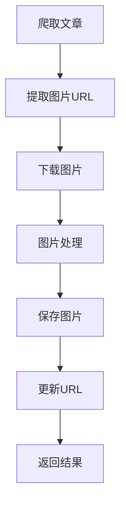

# 图片处理数据流说明文档

## 一、整体流程



## 二、前端流程

### 1. 图片加载
```javascript
// frontend/src/components/ArticleDetail.vue
const loadArticleImages = async () => {
  try {
    const response = await axios.get(`/api/articles/${articleId}/images`);
    if (response.data) {
      images.value = response.data;
    }
  } catch (error) {
    ElMessage.error('加载图片失败：' + error.message);
  }
}
```

## 三、后端流程

### 1. 控制器层
```java
// src/main/java/org/example/web2_7/controller/ImageController.java
@RestController
@RequestMapping("/api/articles")
public class ImageController {
    
    @Autowired
    private ImageService imageService;
    
    @GetMapping("/{id}/images")
    public ResponseEntity<List<ImageInfo>> getArticleImages(@PathVariable Long id) {
        return ResponseEntity.ok(imageService.getArticleImages(id));
    }
    
    @GetMapping("/images/{imageId}")
    public ResponseEntity<byte[]> getImage(@PathVariable String imageId) {
        return imageService.getImage(imageId);
    }
}
```

### 2. 服务层
```java
// src/main/java/org/example/web2_7/service/ImageService.java
@Service
public class ImageService {
    
    @Autowired
    private ImageRepository imageRepository;
    
    public List<ImageInfo> getArticleImages(Long articleId) {
        return imageRepository.findByArticleId(articleId);
    }
    
    public ResponseEntity<byte[]> getImage(String imageId) {
        ImageInfo image = imageRepository.findById(imageId)
            .orElseThrow(() -> new ImageNotFoundException(imageId));
            
        // 从存储系统获取图片
        byte[] imageData = getImageFromStorage(image.getStoragePath());
        
        return ResponseEntity.ok()
            .contentType(MediaType.parseMediaType(image.getContentType()))
            .body(imageData);
    }
    
    public void processAndSaveImage(String imageUrl, Long articleId) {
        // 下载图片
        byte[] imageData = downloadImage(imageUrl);
        
        // 处理图片
        byte[] processedImage = processImage(imageData);
        
        // 保存图片
        String storagePath = saveImage(processedImage);
        
        // 保存图片信息
        saveImageInfo(imageUrl, storagePath, articleId);
    }
}
```

## 四、数据流转过程

1. **图片获取层**
   - 解析文章HTML
   - 提取图片URL
   - 验证图片有效性

2. **图片处理层**
   - 下载图片
   - 压缩处理
   - 格式转换

3. **存储层**
   - 保存图片文件
   - 记录图片信息
   - 更新URL映射

4. **访问层**
   - 处理图片请求
   - 返回图片数据
   - 缓存处理

## 五、关键技术点

1. **图片处理**
   - 图片压缩
   - 格式转换
   - 水印处理

2. **存储系统**
   - 文件系统
   - 对象存储
   - 缓存系统

3. **性能优化**
   - 异步处理
   - 批量处理
   - CDN加速

## 六、性能优化

1. **处理优化**
   - 异步下载
   - 并行处理
   - 批量保存

2. **存储优化**
   - 分级存储
   - 缓存策略
   - CDN分发

## 七、错误处理

1. **下载错误**
   - 网络超时
   - 图片无效
   - 存储失败

2. **处理错误**
   - 格式错误
   - 处理失败
   - 存储错误

## 八、安全考虑

1. **图片安全**
   - 格式验证
   - 大小限制
   - 内容检查

2. **访问安全**
   - 权限控制
   - 防盗链
   - 流量控制 