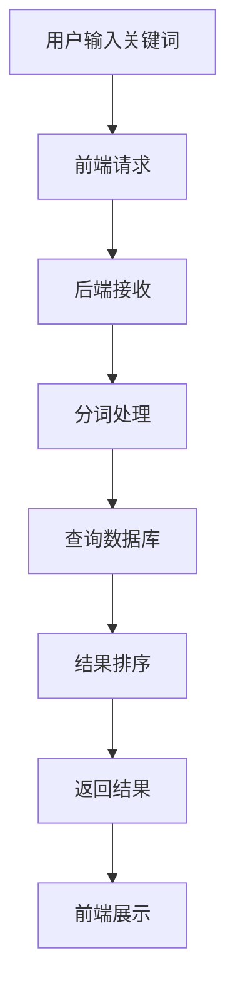

# 搜索功能数据流说明文档

## 一、整体流程



## 二、前端流程

### 1. 搜索组件

```javascript
// frontend/src/components/SearchBar.vue
const handleSearch = async () => {
  try {
    const response = await axios.get('/api/articles/search', {
      params: {
        keyword: searchKeyword.value,
        page: currentPage.value,
        size: pageSize.value
      }
    });
    if (response.data) {
      searchResults.value = response.data.content;
      total.value = response.data.total;
    }
  } catch (error) {
    ElMessage.error('搜索失败：' + error.message);
  }
}
```

## 三、后端流程

### 1. 控制器层

```java
// src/main/java/org/example/web2_7/controller/SearchController.java
@RestController
@RequestMapping("/api/articles")
public class SearchController {
  
    @Autowired
    private SearchService searchService;
  
    @GetMapping("/search")
    public ResponseEntity<Page<Article>> searchArticles(
        @RequestParam String keyword,
        @RequestParam(defaultValue = "0") int page,
        @RequestParam(defaultValue = "10") int size
    ) {
        return ResponseEntity.ok(searchService.searchArticles(keyword, page, size));
    }
}
```

### 2. 服务层

```java
// src/main/java/org/example/web2_7/service/SearchService.java
@Service
public class SearchService {
  
    @Autowired
    private ArticleRepository articleRepository;
  
    @Autowired
    private Tokenizer tokenizer;
  
    public Page<Article> searchArticles(String keyword, int page, int size) {
        // 分词处理
        List<String> tokens = tokenizer.tokenize(keyword);
      
        // 构建查询条件
        Specification<Article> spec = (root, query, cb) -> {
            List<Predicate> predicates = new ArrayList<>();
          
            // 标题匹配
            predicates.add(cb.like(root.get("title"), "%" + keyword + "%"));
          
            // 关键词匹配
            predicates.add(root.get("keywords").in(tokens));
          
            // 内容匹配
            predicates.add(cb.like(root.get("content"), "%" + keyword + "%"));
          
            return cb.or(predicates.toArray(new Predicate[0]));
        };
      
        // 执行查询
        return articleRepository.findAll(spec, PageRequest.of(page, size));
    }
}
```

## 四、数据流转过程

1. **输入处理层**

   - 接收搜索关键词
   - 参数验证
   - 分页处理
2. **分词处理层**

   - 中文分词
   - 停用词过滤
   - 同义词扩展
3. **查询处理层**

   - 构建查询条件
   - 执行数据库查询
   - 结果过滤
4. **排序处理层**

   - 相关度计算
   - 结果排序
   - 分页处理
5. **响应返回层**

   - 构建响应数据
   - 返回给前端
   - 更新界面

## 五、关键技术点

1. **分词技术**

   - 中文分词
   - 停用词处理
   - 同义词处理
2. **搜索算法**

   - 模糊匹配
   - 相关度排序
   - 分页处理
3. **性能优化**

   - 索引优化
   - 缓存处理
   - 异步查询

## 六、性能优化

1. **查询优化**

   - 建立索引
   - 使用缓存
   - 分页处理
2. **分词优化**

   - 词典优化
   - 缓存分词结果
   - 批量处理

## 七、错误处理

1. **输入错误**

   - 关键词为空
   - 参数无效
   - 分页错误
2. **查询错误**

   - 数据库错误
   - 分词错误
   - 排序错误

## 八、安全考虑

1. **输入安全**

   - 关键词过滤
   - 长度限制
   - 特殊字符处理
2. **查询安全**

   - SQL注入防护
   - 查询限制
   - 结果过滤
