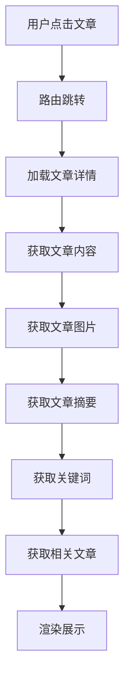

# 文章详情数据流说明文档

## 一、整体流程



## 二、前端流程

### 1. 路由配置
```javascript
// frontend/src/router/index.js
{
  path: '/article/:id',
  name: 'ArticleDetail',
  component: () => import('@/components/ArticleDetail.vue')
}
```

### 2. 组件实现
```javascript
// frontend/src/components/ArticleDetail.vue
const loadArticle = async () => {
  try {
    const response = await axios.post('/api/crawler/articles/detail', {
      url: route.params.id
    });
    if (response.data) {
      article.value = response.data;
      // 加载文章头图
      await loadHeadImage();
      // 加载文章标签
      await loadArticleTags();
      // 加载相关文章
      await loadRelatedArticles();
    }
  } catch (error) {
    ElMessage.error('加载文章失败：' + error.message);
  }
}
```

## 三、后端流程

### 1. 控制器层
```java
// src/main/java/org/example/web2_7/controller/ArticleController.java
@RestController
@RequestMapping("/api/crawler/articles")
public class ArticleController {
    
    @PostMapping("/detail")
    public ResponseEntity<Article> getArticleDetail(@RequestBody Map<String, String> request) {
        String url = request.get("url");
        return ResponseEntity.ok(articleService.getArticleDetail(url));
    }
}
```

### 2. 服务层
```java
// src/main/java/org/example/web2_7/service/ArticleService.java
public interface ArticleService {
    Article getArticleDetail(String url);
    String getProcessedArticleHtml(Long articleId);
    List<Article> getRelatedArticles(Long articleId);
}
```

## 四、数据流转过程

1. **路由跳转层**
   - 用户点击文章链接
   - 路由参数传递
   - 组件加载

2. **文章加载层**
   - 获取文章基本信息
   - 获取文章内容
   - 获取文章图片

3. **内容处理层**
   - 处理HTML内容
   - 处理图片URL
   - 处理文章格式

4. **相关数据层**
   - 获取文章摘要
   - 获取关键词
   - 获取相关文章

5. **渲染展示层**
   - 渲染文章内容
   - 渲染图片
   - 渲染相关文章

## 五、关键技术点

1. **Vue路由系统**
   - 路由参数传递
   - 组件懒加载
   - 路由守卫

2. **内容处理**
   - HTML解析
   - 图片处理
   - 格式转换

3. **数据加载**
   - 异步请求
   - 数据缓存
   - 错误处理

## 六、性能优化

1. **加载优化**
   - 组件懒加载
   - 图片懒加载
   - 数据预加载

2. **渲染优化**
   - 虚拟滚动
   - 图片压缩
   - 缓存处理

## 七、错误处理

1. **加载错误**
   - 网络错误
   - 数据错误
   - 渲染错误

2. **内容错误**
   - 格式错误
   - 图片错误
   - 链接错误 