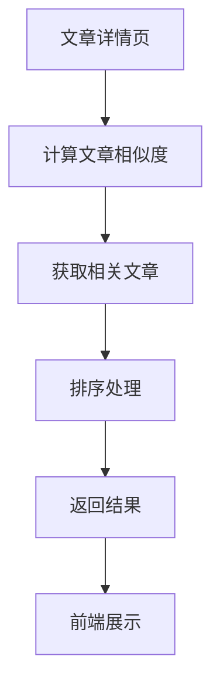

# 相关文章数据流说明文档

## 一、整体流程



## 二、前端流程

### 1. 组件实现
```javascript
// frontend/src/components/ArticleDetail.vue
const loadRelatedArticles = async () => {
  try {
    const response = await axios.get(`/api/articles/${articleId}/related`);
    if (response.data) {
      relatedArticles.value = response.data;
    }
  } catch (error) {
    ElMessage.error('加载相关文章失败：' + error.message);
  }
}
```

## 三、后端流程

### 1. 控制器层
```java
// src/main/java/org/example/web2_7/controller/ArticleController.java
@RestController
@RequestMapping("/api/articles")
public class ArticleController {
    
    @GetMapping("/{id}/related")
    public ResponseEntity<List<Article>> getRelatedArticles(@PathVariable Long id) {
        return ResponseEntity.ok(articleService.getRelatedArticles(id));
    }
}
```

### 2. 服务层
```java
// src/main/java/org/example/web2_7/service/ArticleService.java
public interface ArticleService {
    List<Article> getRelatedArticles(Long articleId);
}

// 实现类
@Service
public class ArticleServiceImpl implements ArticleService {
    
    @Autowired
    private ArticleRepository articleRepository;
    
    @Override
    public List<Article> getRelatedArticles(Long articleId) {
        // 获取当前文章
        Article currentArticle = articleRepository.findById(articleId)
            .orElseThrow(() -> new ArticleNotFoundException(articleId));
            
        // 计算相似度并获取相关文章
        return articleRepository.findRelatedArticles(
            currentArticle.getKeywords(),
            currentArticle.getCategory(),
            articleId
        );
    }
}
```

## 四、数据流转过程

1. **相似度计算层**
   - 提取文章关键词
   - 计算文章相似度
   - 确定相关度阈值

2. **数据获取层**
   - 查询数据库
   - 过滤无关文章
   - 获取文章信息

3. **排序处理层**
   - 按相似度排序
   - 限制返回数量
   - 处理分页

4. **响应返回层**
   - 构建响应数据
   - 返回给前端
   - 更新界面

## 五、关键技术点

1. **相似度算法**
   - 关键词匹配
   - 余弦相似度
   - TF-IDF算法

2. **数据库查询**
   - 索引优化
   - 分页处理
   - 缓存策略

3. **性能优化**
   - 异步处理
   - 结果缓存
   - 批量处理

## 六、性能优化

1. **查询优化**
   - 建立索引
   - 使用缓存
   - 限制数量

2. **计算优化**
   - 预计算相似度
   - 批量处理
   - 异步计算

## 七、错误处理

1. **数据错误**
   - 文章不存在
   - 数据不完整
   - 计算错误

2. **系统错误**
   - 数据库错误
   - 缓存错误
   - 服务异常 