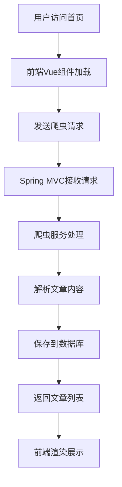

# 首页爬虫请求数据流说明文档

## 一、整体流程



## 二、前端流程

### 1. 路由配置
```javascript
// frontend/src/router/index.js
{
  path: '/',
  name: 'Home',
  component: () => import('@/views/Home.vue')
}
```

### 2. 组件实现
```javascript
// frontend/src/views/Home.vue
const loadArticles = async () => {
  loading.value = true;
  try {
    // 获取文章列表
    const response = await axios.get('/api/crawler/articles');
    if (response.data) {
      articles.value = response.data;
    }
  } catch (error) {
    ElMessage.error('加载文章失败：' + error.message);
  } finally {
    loading.value = false;
  }
}

// 启动爬虫
const startCrawler = async () => {
  crawlerLoading.value = true;
  try {
    const response = await axios.post('/api/crawler/start');
    if (response.data.success) {
      ElMessage.success('爬虫启动成功');
      // 重新加载文章列表
      await loadArticles();
    }
  } catch (error) {
    ElMessage.error('启动爬虫失败：' + error.message);
  } finally {
    crawlerLoading.value = false;
  }
}
```

## 三、后端流程

### 1. 控制器层
```java
// src/main/java/org/example/web2_7/controller/CrawlerController.java
@RestController
@RequestMapping("/api/crawler")
@CrossOrigin(originPatterns = "*", allowCredentials = "true")
public class CrawlerController {
    
    @Autowired
    private CrawlerService crawlerService;
    
    @GetMapping("/articles")
    public ResponseEntity<List<Article>> getArticles() {
        return ResponseEntity.ok(crawlerService.getArticles());
    }
    
    @PostMapping("/start")
    public ResponseEntity<Map<String, Object>> startCrawler() {
        return ResponseEntity.ok(crawlerService.startCrawler());
    }
}
```

### 2. 服务层接口
```java
// src/main/java/org/example/web2_7/service/CrawlerService.java
public interface CrawlerService {
    List<Article> getArticles();
    Map<String, Object> startCrawler();
}
```

### 3. 爬虫实现
```java
// src/main/java/org/example/web2_7/crawler/WeixinCrawler.java
public class WeixinCrawler {
    // 爬虫配置
    private final CrawlerConfig config;
    
    // 爬取文章
    public List<Article> crawlArticles() {
        // 实现爬虫逻辑
    }
    
    // 解析文章内容
    private Article parseArticle(String url) {
        // 实现解析逻辑
    }
}
```

## 四、数据流转过程

1. **用户访问层**
   - 用户访问首页
   - 触发Vue组件加载
   - 显示加载状态

2. **前端请求层**
   - 发送获取文章列表请求
   - 发送启动爬虫请求
   - 处理响应结果

3. **后端控制层**
   - Spring MVC接收请求
   - 路由到对应控制器方法
   - 参数验证和处理

4. **爬虫处理层**
   - 配置爬虫参数
   - 执行爬虫任务
   - 解析文章内容

5. **数据持久层**
   - 保存文章信息
   - 保存图片资源
   - 更新数据库记录

6. **响应返回层**
   - 构建文章列表响应
   - 返回给前端
   - 更新界面显示

## 五、关键技术点

1. **爬虫技术**
   - HTTP请求处理
   - HTML解析
   - 图片下载
   - 内容提取

2. **Spring MVC注解**
   - @RestController
   - @RequestMapping
   - @GetMapping
   - @PostMapping

3. **Vue响应式系统**
   - ref：状态管理
   - computed：计算属性
   - v-for：列表渲染
   - v-if：条件渲染

4. **异步处理**
   - 爬虫异步执行
   - 前端异步请求
   - 错误处理机制

## 六、错误处理

1. **前端错误处理**
   - 网络请求错误
   - 数据加载失败
   - 用户提示

2. **爬虫错误处理**
   - 网络连接错误
   - 解析错误
   - 存储错误

3. **系统错误处理**
   - 服务异常
   - 数据库错误
   - 资源限制

## 七、性能优化

1. **爬虫优化**
   - 并发控制
   - 请求限流
   - 资源复用

2. **前端优化**
   - 分页加载
   - 图片懒加载
   - 缓存处理

3. **后端优化**
   - 数据库索引
   - 缓存机制
   - 异步处理

## 八、安全考虑

1. **爬虫安全**
   - 请求头伪装
   - 代理IP使用
   - 访问频率控制

2. **接口安全**
   - 跨域处理
   - 参数验证
   - 权限控制

3. **数据安全**
   - 数据验证
   - 敏感信息处理
   - 日志记录

## 九、监控和日志

1. **爬虫监控**
   - 爬取进度
   - 成功率统计
   - 性能监控

2. **系统日志**
   - 操作日志
   - 错误日志
   - 性能日志

3. **数据统计**
   - 文章数量
   - 图片数量
   - 更新频率 